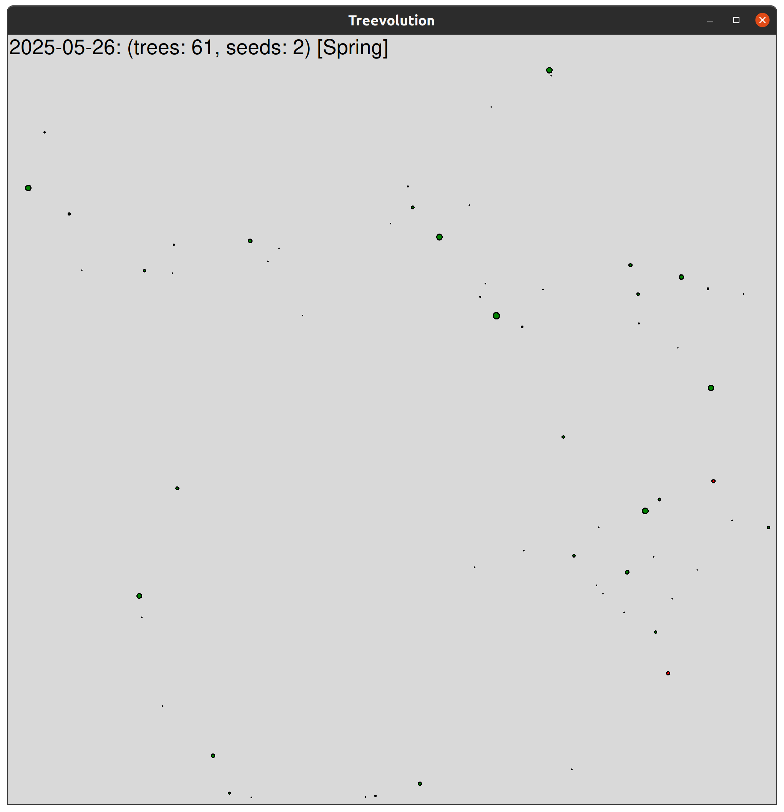
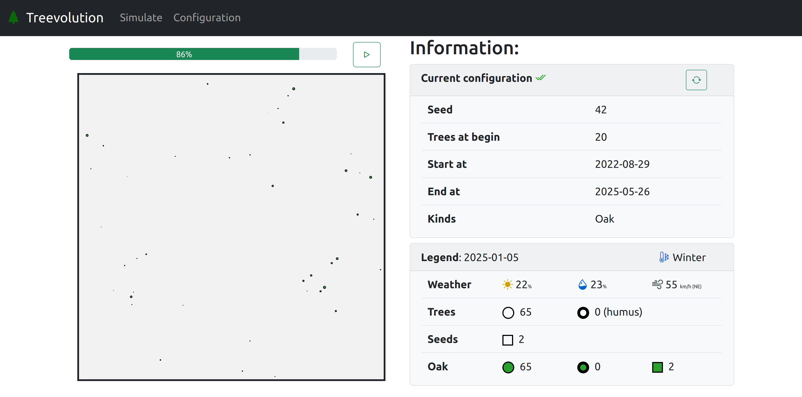

# Treevolution

## Description

Python package for forest evolution.

**Author:** zakaria EL asri

## Resources

- Course link: [https://jeromebuisine.fr/teaching/#2022---2023](https://jeromebuisine.fr/teaching/#2022---2023)
- Google Sheet link: [add your project information here](https://docs.google.com/spreadsheets/d/1wV-RaQ01r4oX9JfSzolSzC5ofiqHg1Z9QQdq1BO-Q-E/edit?usp=sharing)

## Application overview

## Web site overview

